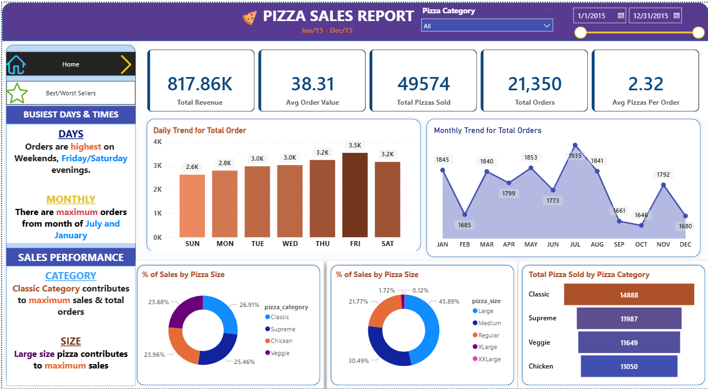
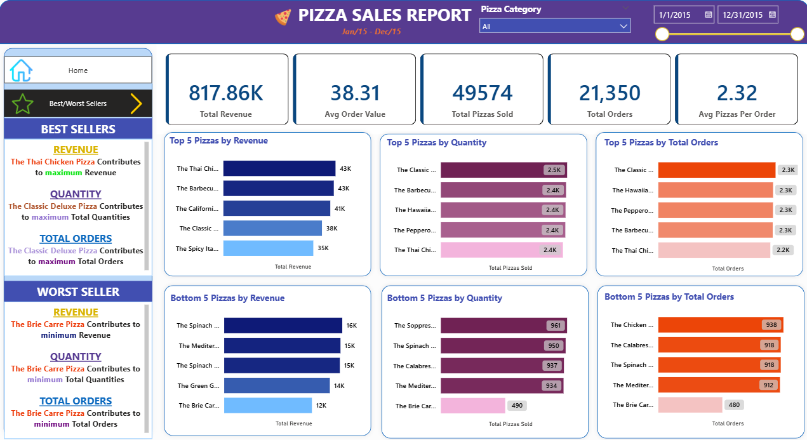
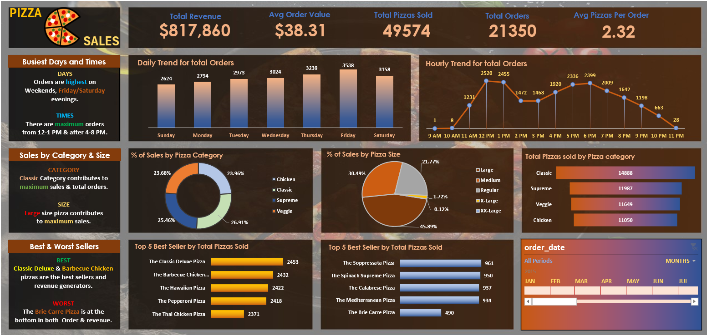

# 🍕 Pizza Sales Analytics Dashboard

An end-to-end **data analysis and visualization project** built using **Power BI and Excel** to analyze pizza sales performance, customer behavior, and business trends.

---

## 📌 Project Overview

This project focuses on analyzing pizza sales data to uncover:
- Revenue trends
- Best & worst selling pizzas
- Order patterns by day, month, and hour
- Sales contribution by category and size

The dashboards help business owners make **data-driven decisions** related to pricing, inventory, and promotions.

---

## 🛠 Tools & Technologies

- **Power BI** – Interactive dashboards & DAX calculations
- **Microsoft Excel** – Data cleaning & analysis
- **SQL (conceptual)** – Used for aggregations & insights logic
- **Git & GitHub** – Version control & project hosting

---

## 📊 Key KPIs

- **Total Revenue:** $817,860  
- **Average Order Value:** $38.31  
- **Total Orders:** 21,350  
- **Total Pizzas Sold:** 49,574  
- **Average Pizzas per Order:** 2.32  

---

## 🔍 Business Insights

### 🏆 Best Sellers
- Classic Deluxe Pizza
- Barbecue Chicken Pizza
- Hawaiian Pizza

### ❌ Worst Seller
- Brie Carre Pizza (lowest revenue & orders)

### 📅 Peak Sales
- **Highest Orders:** Fridays & Saturdays
- **Peak Hours:** 12–1 PM and 4–8 PM
- **Best Month:** July

### 🍕 Category & Size Performance
- **Top Category:** Classic
- **Top Size:** Large pizzas contribute maximum revenue

---

## 📷 Dashboard Preview

### Power BI – Home Dashboard

### Best & Worst Sellers Analysis

### Excel Dashboard

---

## 📂 Project Structure

